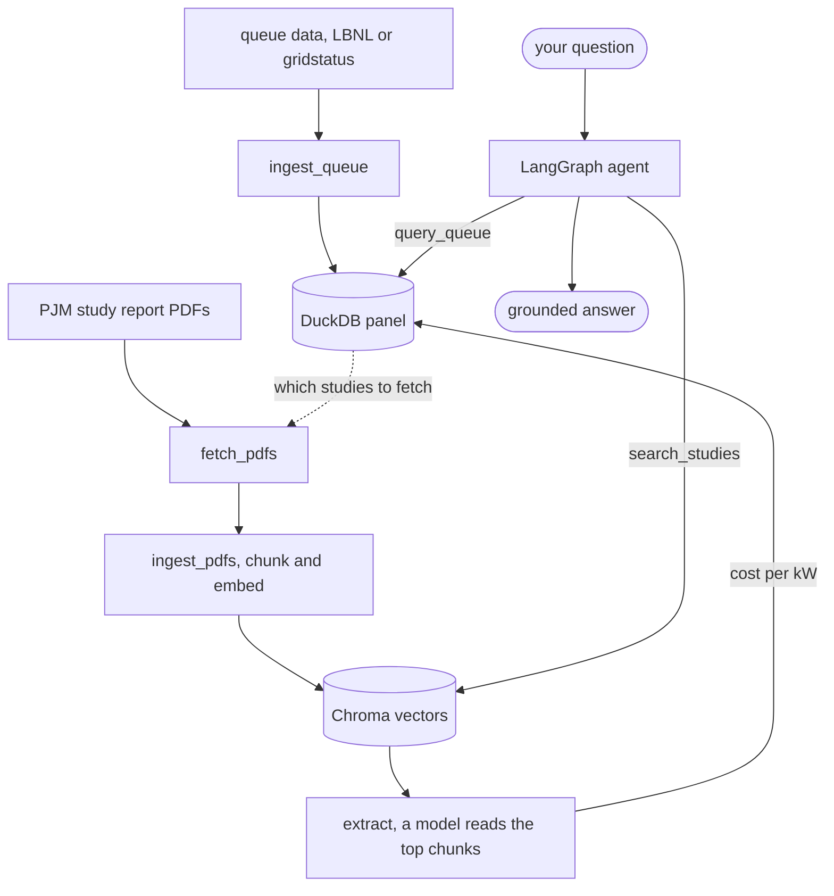

# Interconnection Queue Intelligence Agent

An agent that answers questions about United States electricity grid interconnection projects. It reasons over two things at once, the clean structured queue data and the messy study report PDFs that sit behind it.

## What it does

You ask a plain question, for example which solar projects look most at risk of withdrawing and why. The agent finds the projects and their numbers in the structured data, reads the relevant study reports to explain the drivers, and writes an answer that cites specific projects and specific passages. It gets its totals from the structured data and uses the reports for the detail behind them.

## Why I built this

Connecting new power plants to the grid is one of the biggest blockers for clean energy in the United States. Before a project can connect it has to join an interconnection queue and pass a series of engineering studies. Most projects never make it. Of all the generation capacity that asked to connect between 2000 and 2020, only about 13 percent was running by the end of 2025. Around 75 percent withdrew.

The single biggest reason projects withdraw is the cost of network upgrades. When a project is told it must pay for expensive upgrades to the grid, it often drops out. That cost can then shift onto the projects behind it in the queue, which can trigger more withdrawals.

The data that explains all of this is public, but it is split between two places. The structured queue data is clean. It says which projects exist, how big they are, what fuel they use, and whether they withdrew. The cost detail is much harder to use. It sits inside long study report PDFs, one per project, full of tables and prose.

Lawrence Berkeley National Laboratory reads those PDFs by hand to pull out the cost numbers, about twenty minutes per project. I wanted to see if a language model could do that step on its own, and if an agent could then reason over the structured data and the reports together. The structured data tells you what happened. The reports tell you why. Putting the two together is the interesting part, and almost nobody has built tooling over these PDFs.

## How it works

The system has two halves. The first half builds the data. The second half answers questions.

Building the data runs in four steps. First, ingest_queue reads the queue data and writes one clean table to DuckDB, one row per project. Then fetch_pdfs reads the project list from the panel and downloads the PJM study report PDF for each project that has one. Then ingest_pdfs splits every PDF into chunks and embeds them into a Chroma vector store. Finally extract sends the most relevant chunks of each study to a language model, which pulls out the cost figures. Those figures become a cost per kW and are written back onto the project row in DuckDB.

Answering a question uses an agent with two tools. query_queue runs read only SQL against the DuckDB panel, so the agent can find projects and their numbers. search_studies pulls the most relevant passages from the study reports, so the agent can explain why a cost is high and what upgrades drive it. The agent decides which tools to call, reads the results, and writes the answer.

The search_studies side is retrieval augmented generation, RAG for short. The query is embedded, the closest passages are pulled from the vector store, and the model writes its answer from them and cites them. The design leans on RAG only where it earns its place, on the narrative half, where the useful facts are scattered through long reports. The numbers never go through retrieval. They come straight from the panel with exact SQL, so a total is a real total, not a figure the model happened to read. Using RAG for the prose and exact queries for the numbers is the core design choice.

Here is the whole flow.



## Project layout

```
src/
  config.py         settings, paths, and model prices
  ingest_queue.py   build the DuckDB panel
  fetch_pdfs.py     download PJM study PDFs
  ingest_pdfs.py    chunk and embed the PDFs
  extract.py        pull cost figures with a language model
  tools.py          the two agent tools
  agent.py          the LangGraph agent
  cli.py            the command line entry point
tests/              offline tests, plus the by hand evaluation
```

## The data

Two stores hold the data. DuckDB holds the structured panel, one row per project, with capacity, fuel, status, dates, location, and a cost per kW where a study has been extracted. Chroma holds the embedded chunks of the study PDFs, each tagged with the project it came from.

Right now three projects have a full extracted cost, all of them withdrawn solar or solar plus storage. AC2-093 sits at about 412 dollars per kW, AF1-236 at about 391, and AF2-353 at about 374. Each figure comes from hundreds of millions of dollars of required network upgrades, read out of the study reports.

## Built with

- Python 3.11 or newer
- LangChain and LangGraph for the agent and the retrieval plumbing
- OpenAI for embeddings, cost extraction, and the agent's reasoning
- DuckDB for the structured queue panel
- Chroma for the local vector store
- gridstatus and the LBNL Queued Up dataset for the queue data

## Quickstart

Everything runs locally against a Python virtual environment. First install the dependencies and create your env file.

```
python -m venv .venv
source .venv/bin/activate
pip install -r requirements.txt
cp .env.example .env
```

Open .env and set OPENAI_API_KEY to your own key. DRY_RUN ships as true, so nothing calls the paid API until you set it to false on purpose.

Check your setup before anything else. This makes no API call.

```
python -m src.cli setup-check
```

Build the queue panel. Download the LBNL Queued Up workbook once by hand, place it in data/raw/queue, then run this.

```
python -m src.ingest_queue --source lbnl --file data/raw/queue/your_workbook.xlsx
```

Fetch a small sample of study PDFs, then embed them. The fetch is free. The embed calls the API, so set DRY_RUN to false first.

```
python -m src.fetch_pdfs
DRY_RUN=false python -m src.ingest_pdfs --loader pypdf
```

Extract the cost figures. This reads the top chunks of each study and writes a cost per kW back into the panel.

```
DRY_RUN=false python -m src.extract
```

Ask a question.

```
python -m src.cli ask "which projects have the highest network upgrade cost per kW and why"
```

For a running conversation that keeps context across turns, use chat instead.

```
python -m src.cli chat
```

## Example

Ask which projects have the highest network upgrade cost per kW and why. The agent queries the panel to rank them, then reads the study reports to explain the drivers. For AC2-093 it reports a cost of about 412 dollars per kW, points to hundreds of millions of dollars of transmission line rebuilds as the cause, and notes that the project has already withdrawn. It never says a project will withdraw for certain. It frames the cost as a risk factor and is clear about where each number came from.

## Cost

Running this is cheap by design. Nothing calls the paid API until you set DRY_RUN to false. Every paid step has a cap and skips work it has already done. Extraction only sends the few most relevant chunks of each study to the model, never a whole PDF. A full test of the finished system costs well under one dollar. The evaluation over all of its questions costs a few cents.

## Tests and evaluation

The test suite runs offline with the model mocked, so it needs no key and no network.

```
python -m pytest
```

There is also a small evaluation that runs the real agent against a handful of realistic questions. It prints each answer, whether it passed a check, and the running cost. It is run by hand because it calls the API.

```
DRY_RUN=false python -m tests.eval_questions
```

## Limitations

- Quoted study costs are early estimates, not final bills. A project that withdraws usually does not pay the full amount, so read a quoted cost as an upper bound.
- The study report PDFs are PJM only. Other grid operators do not post them freely, so the narrative half of the system covers PJM.
- Withdrawal risk here is reasoning, not prediction. The agent weighs known cost signals against public research findings and frames risk. It never claims a project will withdraw for certain, and it is not a trained model.
- Cost extraction can miss figures. Some studies give one clean upgrade total, others spread the cost across many lines with no total, which is harder to read. The code handles the common shapes, so read the numbers as careful estimates.

## Future work

- Add more grid operators to the structured data. The schema already has an iso column for this.
- Add CAISO study reports where they are posted publicly.
- Train a withdrawal model once enough cost history has been extracted, to replace the reasoning layer with a calibrated probability.

## References

- LBNL Queued Up dataset and interconnection cost series, https://emp.lbl.gov/queues
- US Department of Energy i2X program
- Gorman et al., grid connection barriers, Joule 2024
